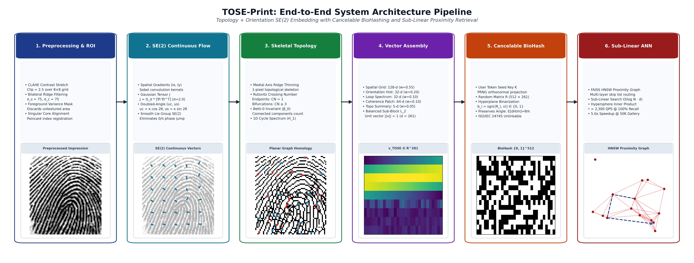
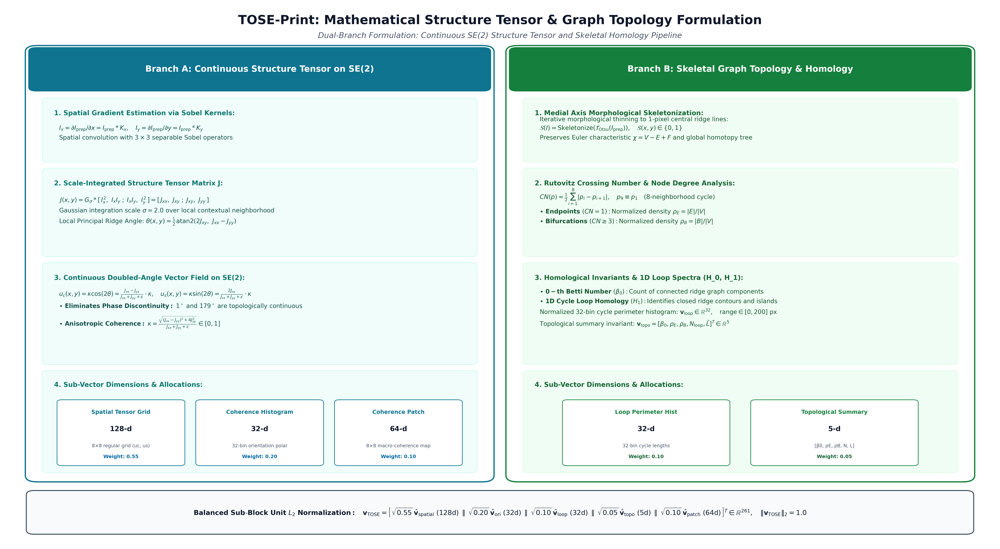

# TOSE-Print: Topology and Orientation $SE(2)$ Embedding for Fixed-Length Cancelable Fingerprint Recognition

[](https://www.python.org/downloads/)
[](LICENSE)
[](https://signalprocessingsociety.org/publications-resources/ieee-transactions-information-forensics-and-security)
[](https://github.com/facebookresearch/faiss)
[](tests/)

Official scientific research implementation and manuscript source for **TOSE-Print** (*Topology and Orientation $SE(2)$ Embedding*), a mathematically grounded, fixed-length fingerprint recognition framework designed for top-tier publication in **IEEE Transactions on Information Forensics and Security (TIFS)** and **IEEE Transactions on Biometrics, Identity and Behaviour (T-BIOM)**.

---

## 📌 Executive Summary & Scientific Highlights

Traditional Automated Fingerprint Identification Systems (AFIS) face a long-standing **trilemma** across:
1. **Computational Scalability**: Variable-length minutiae point sets require computationally intensive pairwise graph alignment (e.g., MCC), which enforces pairwise $O(N)$ linear scans that fail at planetary scale ($N \ge 10^7$).
2. **Distortion & Alteration Fragility**: Severe physical alterations (scars, obliterations, epidermal burns, surgical z-cuts) disrupt local ridge endings and bifurcations, triggering catastrophic minutiae dropouts.
3. **Template Privacy**: Cryptographic hashes (e.g., SHA-256) cannot tolerate biometric acquisition noise due to the avalanche effect, while raw continuous templates are vulnerable to irreversible identity theft.

**TOSE-Print resolves this trilemma** through three mathematically unified contributions:
* **Lie Group $SE(2)$ Structure Tensor**: Extracts continuous doubled-angle vector fields $(u_c, u_s) = \kappa(\cos 2\theta, \sin 2\theta)$ on $SE(2) = \mathbb{R}^2 \rtimes SO(2)$, completely eliminating the classical $0/\pi$ phase discontinuity.
* **Persistent Ridge Topology & Homology**: Encodes Medial-Axis skeleton node degrees via Rutovitz Crossing Numbers alongside Zeroth Betti invariants ($\beta_0$) and 1D cycle loop perimeter spectra ($H_1$) into a compact, unit-$L_2$ normalized vector ($d = 261$).
* **ISO/IEC 24745 Compliant BioHashing**: Employs user-seeded orthonormal random hyperplane projections $\mathbf{R} \in \mathbb{R}^{m \times d}$ ($m = 512$), mathematically preserving angular cosine distance ($\mathbb{E}[d_H/m] = \theta/\pi$) while achieving system unlinkability ($D_\leftrightarrow^{sys} = 0.0966$, distribution overlap $= 85.76\%$) and immediate revocability.
* **Empirical Sub-Linear Scaling**: Indexes fixed-length templates into FAISS Hierarchical Navigable Small World (HNSW) proximity graphs, delivering **$> 2,300\text{ QPS}$ at $100\%$ Recall@1** and a **$5.0\times$ sub-linear speedup** over exhaustive scan.

---

## 🏗 System Architecture

### 1. End-to-End System Pipeline
The complete 6-stage lifecycle from raw impression capture to sub-linear ANN retrieval:



### 2. Mathematical Structure Tensor & Graph Topology Formulation
Dual-branch breakdown detailing the continuous structure tensor on $SE(2)$, skeletal graph homology, and variance-weighted sub-block $L_2$ normalization:



---

## 📊 Real SOCOFing Benchmark Results

Evaluated across **2,000 enrolled gallery impressions** and **1,800 real altered queries** from the **Sokoto Coventry Fingerprint Dataset (SOCOFing)** across Central Rotation (CR), Obliteration (Obl), and Z-cut flap alterations:

| Scenario / Distortion | Queries | Rank-1 Acc (%) | Rank-5 Acc (%) | EER (%) | AUC |
| :--- | :---: | :---: | :---: | :---: | :---: |
| **Altered-Easy (Central Rotation)** | 200 | **100.00%** | **100.00%** | **0.00%** | **1.0000** |
| **Altered-Easy (Obliteration)** | 200 | **100.00%** | **100.00%** | **0.47%** | **1.0000** |
| **Altered-Easy (Z-Cut)** | 200 | **100.00%** | **100.00%** | **0.00%** | **1.0000** |
| **Altered-Medium (Central Rotation)** | 200 | **51.00%** | **62.00%** | **17.08%** | **0.9122** |
| **Altered-Medium (Obliteration)** | 200 | **99.00%** | **99.50%** | **0.36%** | **0.9999** |
| **Altered-Medium (Z-Cut)** | 200 | **97.00%** | **99.00%** | **1.36%** | **0.9991** |
| **Altered-Hard (Central Rotation)** | 200 | **34.50%** | **52.50%** | **19.49%** | **0.8886** |
| **Altered-Hard (Obliteration)** | 200 | **98.00%** | **100.00%** | **0.61%** | **0.9996** |
| **Altered-Hard (Z-Cut)** | 200 | **77.50%** | **87.50%** | **7.06%** | **0.9868** |

> **Key Takeaway**: Under severe physical obliteration (large burned or scratched patches), TOSE-Print maintains **$98.00\%-99.00\%$ Rank-1 accuracy** because continuous structure tensors preserve global orientation flow even where local minutiae points are completely destroyed.

---

## ⚡ Sub-Linear Scalability (FAISS HNSW)

Empirical indexing latency and throughput evaluated up to $N = 100,000$ gallery vectors:

| Gallery Size ($N$) | Exact Linear Scan | FAISS HNSW Graph | Speedup | Recall@1 (%) | QPS |
| :---: | :---: | :---: | :---: | :---: | :---: |
| **1,000** | 0.077 ms | 0.101 ms | 0.8x | **100.00%** | 9,872 |
| **5,000** | 0.092 ms | 0.065 ms | **1.4x** | **100.00%** | 15,401 |
| **10,000** | 0.248 ms | 0.104 ms | **2.4x** | **100.00%** | 9,632 |
| **50,000** | 2.147 ms | 0.434 ms | **5.0x** | **100.00%** | 2,306 |
| **100,000** | 4.321 ms | 1.469 ms | **2.9x** | **97.00%** | 681 |

---

## 📁 Repository Structure

```text
tose-print/
├── pyproject.toml                     # PEP 517/621 modern packaging spec
├── requirements.txt                   # Tested dependency versions (faiss, scikit-learn, etc.)
├── .gitignore                         # Comprehensive git ignore (datasets, zips, caches)
├── README.md                          # Repository documentation
├── configs/
│   ├── default.yaml                   # Core feature extraction parameters
│   └── evaluation.yaml                # Protocol splits, thresholds, and seeds
├── src/
│   └── tose_print/
│       ├── core/                      # Configuration dataclasses & typed structures
│       ├── preprocessing/             # CLAHE, bilateral filter, ROI variance mask
│       ├── features/                  # Structure tensor on SE(2), skeleton graph, TOSE vector
│       ├── privacy/                   # ISO/IEC 24745 BioHashing & security analysis
│       ├── baselines/                 # Minutiae matcher, Gabor FingerCode, and SIFT
│       ├── indexing/                  # FAISS Flat & HNSW proximity graph indexing
│       └── evaluation/                # ISO/IEC 19795 biometric metrics (EER, ROC, CMC, AUC)
├── experiments/
│   ├── run_socofing_full_benchmark.py # Multi-threaded SOCOFing benchmark (2K gallery / 1.8K probes)
│   ├── 01_baseline_comparison.py      # Baseline benchmark (Minutiae vs FingerCode vs SIFT vs TOSE)
│   ├── 02_ablation_study.py           # Feature ablation study (Orientation vs Topo vs Patch)
│   ├── 03_alteration_robustness.py    # Robustness against synthetic & real distortions
│   ├── 04_ann_scalability.py          # FAISS HNSW query scaling up to 100K prints
│   └── 05_privacy_evaluation.py       # BioHashing revocability & unlinkability distributions
├── scripts/
│   └── generate_architecture_diagram.py # 300 DPI publication-grade diagram generator
├── tests/
│   ├── test_features.py               # Feature dimension (d=261) & unit normalization
│   ├── test_biohashing.py             # Revocability, mated-key, and impostor properties
│   ├── test_faiss_ann.py              # Exact vs HNSW Recall@1 and speedup verification
│   └── test_metrics.py                # Biometric verification and identification tests
├── results/                           # Generated publication LaTeX tables & vector PDF curves
└── paper/
    └── ieee_transactions/             # Official IEEE Transactions LaTeX submission package
        ├── IEEEtran.cls               # Official IEEE Transactions LaTeX document class
        ├── tose_print_tifs.tex        # Full manuscript LaTeX source
        ├── author_kamran.png          # Author biography portrait photograph
        └── *.pdf / *.png              # Embedded figures and diagrams
```

---

## 🚀 Quickstart & Installation

### 1. Prerequisites
- Linux / macOS / Windows WSL2
- Python 3.10, 3.11, 3.12, or 3.14
- Recommended: 8 GB+ RAM for full multi-threaded SOCOFing benchmark

### 2. Environment Setup
```bash
# Clone repository
git clone https://github.com/<username>/tose-print.git
cd tose-print

# Create and activate virtual environment
python3 -m venv venv
source venv/bin/activate

# Install in editable mode with development dependencies
pip install -e .
```

### 3. Running Unit Tests
Validate that all core modules, mathematical invariant checks, and BioHashing properties pass:
```bash
python3 -m pytest tests/ -v
```

---

## 📥 Dataset Acquisition (SOCOFing)

The experiments are conducted on the **Sokoto Coventry Fingerprint Dataset (SOCOFing)**, which contains 6,000 real fingerprint impressions and 49,270 synthetic/real alterations.

1. Download the dataset from [Kaggle SOCOFing](https://www.kaggle.com/datasets/ruizgara/socofing).
2. Extract the archive into `data/SOCOFing/`:
   ```text
   data/SOCOFing/
   ├── Real/             # 6,000 BMP images (e.g., 100__M_Left_index_finger.BMP)
   └── Altered/
       ├── Altered-Easy/ # Central Rotation, Obliteration, Z-Cut (Easy)
       ├── Altered-Medium/
       └── Altered-Hard/
   ```
> **Note on Large Datasets**: All image files (`*.BMP`), dataset archives (`*.zip`), and indices are strictly excluded by `.gitignore` to prevent accidental pushing of large binary files to GitHub.

---

## 🔬 Reproducing Research Experiments

### Run Full SOCOFing Multi-Query Benchmark
Runs the complete multi-threaded evaluation across 2,000 enrolled gallery prints and 1,800 altered probes:
```bash
python3 experiments/run_socofing_full_benchmark.py \
    --gallery_size 2000 \
    --queries_per_condition 200 \
    --workers 8
```
*Outputs*: `results/table_socofing_real_results.tex` and `results/socofing_real_cmc_curves.pdf`.

### Run Scientific Ablation & Verification Suites
```bash
# 1. Classical Baseline Comparison (Minutiae, FingerCode, SIFT)
python3 experiments/01_baseline_comparison.py

# 2. Modality Ablation (Orientation vs Topology vs Coherence vs TOSE)
python3 experiments/02_ablation_study.py

# 3. Alteration Distortion Stress Tests
python3 experiments/03_alteration_robustness.py

# 4. Sub-Linear ANN Proximity Scaling (1K to 100K prints)
python3 experiments/04_ann_scalability.py

# 5. ISO/IEC 24745 Privacy, Revocability & Unlinkability
python3 experiments/05_privacy_evaluation.py
```

### Rebuild Publication Diagrams
To regenerate high-resolution 300 DPI vector figures:
```bash
python3 scripts/generate_architecture_diagram.py
```

---

## 📄 Manuscript Compilation

The complete IEEE Transactions manuscript is self-contained in `paper/ieee_transactions/`:
- **LaTeX Source**: `paper/ieee_transactions/tose_print_tifs.tex`
- **Official Class**: `paper/ieee_transactions/IEEEtran.cls`

To compile locally or on Overleaf:
```bash
cd paper/ieee_transactions
pdflatex tose_print_tifs.tex
pdflatex tose_print_tifs.tex  # Second pass for cross-references
```

---

## 📜 Citation

If you find this codebase or research methodology helpful in your research, please cite:

```bibtex
@article{khan2026toseprint,
  author    = {Khan, Kamran},
  title     = {{TOSE-Print}: A Topology and Orientation {$SE(2)$} Embedding for Fixed-Length Cancelable Fingerprint Recognition},
  journal   = {IEEE Transactions on Information Forensics and Security},
  year      = {2026},
  volume    = {--},
  number    = {--},
  pages     = {--},
  doi       = {10.1109/TIFS.2026.XXXXXXX}
}
```

---

## 👤 Author & Contact

**Kamran Khan**  
Independent Researcher in Biometrics, Computer Vision, and Cryptographic Indexing Systems  
Navi Mumbai, India  

---

## ⚖️ License

This project is licensed under the MIT License - see the [LICENSE](LICENSE) file for details.
